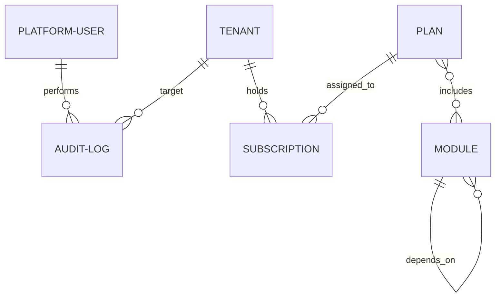

# Entidades de Primer Nivel - Backoffice Admin (AUREA Platform)

Este backend (`backoffice-be-aurea-internal`) es el **panel de control de la empresa AUREA**, no de los clientes finales. Su función exclusiva es que los *Platform Owners* y *Platform Operators* gobiernen el SaaS multi-tenant.

A partir de la arquitectura definida en `technical.md` y el código existente, detectamos **5 entidades de primer nivel**.

---

## Mapa de Entidades de Primer Nivel

---

## 1. `Modules` (Catálogo de Capacidades)
> **¿Qué representa?** El inventario de todo lo que el producto de software AUREA es capaz de hacer.

- **Ruta REST base**: `/api/v1/modules`
- **Responsabilidad**:
  - Organizar la jerarquía en 3 niveles: `Section` (ej. servicios) → `Page` (ej. reservas) → `Feature` (ej. subir fotos).
  - Controlar el ciclo de vida técnico: `draft` → `active` → `toBeDeprecated` → `deprecated`.
  - Gestionar ventanas de mantenimiento global (pausa operativa sin alterar configuraciones de clientes).
  - Validar dependencias técnicas entre módulos.
- **Quién lo usa**: Desarrolladores y Platform Owners para registrar qué existe en la plataforma.

---

## 2. `Plans` (Empaquetado Comercial)
> **¿Qué representa?** La oferta de producto que se comercializa a las empresas clientes.

- **Ruta REST base**: `/api/v1/plans`
- **Responsabilidad**:
  - Definir tiers de suscripción (ej. *Free, Starter, Pro, Enterprise*).
  - Asociar qué `Modules` están incluidos por defecto en cada plan.
  - Definir límites globales (créditos mensuales, cupo de reservas, almacenamiento).
  - Versionar precios e intervalos de facturación (*mensual, anual*).
- **Quién lo usa**: Equipo de producto / comercial para definir qué se puede vender.

---

## 3. `Tenants` (Empresas / Clientes)
> **¿Qué representa?** Cada una de las empresas o comercios individuales que contratan AUREA (ej. *Peluquería Acme, Bar San Telmo*).

- **Ruta REST base**: `/api/v1/tenants`
- **Responsabilidad**:
  - Identidad del cliente: `name`, `slug` único, `vertical` (*gastronomía, belleza, salud*).
  - Estado operativo del comercio: `active`, `suspended`, `maintenanceMode`.
  - Vincular al tenant con su suscripción y plan activo.
  - Conceder excepciones o sobreescrituras (*overrides*) de módulos específicos para un cliente particular.
- **Quién lo usa**: Soporte y operaciones para dar de alta comercios, suspender por falta de pago o resolver incidencias.

---

## 4. `Platform Users` (Operadores Internos de AUREA)
> **¿Qué representa?** Las personas del equipo interno de AUREA que tienen acceso a este backoffice.

- **Ruta REST base**: `/api/v1/users` (y `/api/v1/auth` para credenciales/sesiones)
- **Responsabilidad**:
  - Autenticación segura de empleados (Google OAuth corporativo / credenciales con refresh tokens rotativos).
  - Asignación de roles de plataforma:
    - `platform_owner`: acceso irrestricto a todo el backoffice.
    - `platform_operator`: acceso granular según permisos asignados (`allowedFeatures`).
  - Revocación de sesiones (`tokenVersion`).
- **Quién lo usa**: Seguridad interna y administración de accesos del personal de AUREA.

---

## 5. `Audit Logs` (Trazabilidad y Seguridad)
> **¿Qué representa?** El historial inmutable de quién hizo qué, cuándo y sobre qué recurso.

- **Ruta REST base**: `/api/v1/audit`
- **Responsabilidad**:
  - Registrar eventos críticos: activación/desactivación de módulos, cambios de plan de un tenant, suspensiones de cuentas, cambios de permisos de operadores.
  - Almacenar el estado anterior (`before`) y el nuevo (`after`) para auditoría forense.
- **Quién lo usa**: Cumplimiento normativo, seguridad e investigación de incidentes.

---

## Comparativa y Resumen de Rutas REST

| Entidad | Recurso REST | Controlador sugerido | ¿Qué gestiona? |
|---|---|---|---|
| **Módulos** | `/api/v1/modules` | `ModulesController` | Jerarquía `Section → Page → Feature`, ciclo de vida y dependencias |
| **Planes** | `/api/v1/plans` | `PlansController` | Paquetes comerciales, precios y módulos incluidos |
| **Tenants** | `/api/v1/tenants` | `TenantsController` | Comercios clientes, slugs, vertical y estado |
| **Usuarios** | `/api/v1/users` & `/auth` | `UsersController` & `AuthController` | Empleados de Aurea, roles y autenticación |
| **Auditoría** | `/api/v1/audit` | `AuditController` | Historial de mutaciones y cambios de estado |

---

## Conclusión sobre la estructura de Controllers

En lugar de tener prefijos anidados como `@Controller('platform/catalog/modules')` o agrupar todo arbitrariamente bajo un mega-controller `@Controller('platform')`:

1. Cada una de estas **5 entidades es de primer nivel**.
2. Cada recurso tiene su propio controller claro y limpio:
   - `modules.controller.ts` → `@Controller('modules')`
   - `tenants.controller.ts` → `@Controller('tenants')`
   - `plans.controller.ts` → `@Controller('plans')`
   - `users.controller.ts` → `@Controller('users')`
   - `audit.controller.ts` → `@Controller('audit')`
